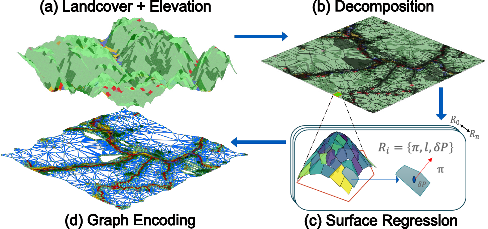

# CLEAR abstraction and path planning

CLEAR builds a reusable semantic-geometric terrain abstraction from landcover
and elevation for scalable path planning across large unstructured environments.

**Accepted to IEEE Robotics and Automation Letters (RA-L), August 2026.**

## Links

- [Project page](https://droneslab.github.io/CLEAR/)
- [Paper on arXiv](https://arxiv.org/abs/2601.13361)

## Framework



## Contents

- `build_abstraction.py`: builds an abstraction graph from terrain arrays.
- `plan_path.py`: runs the paper's raw graph paths and reports their statistics.
- `paper_config.py`: immutable W/H/R paper profiles and experiment constants.
- `clear_core/`: the canonical abstraction, graph, cost-model, and planning modules.
- `requirements.txt`: third-party Python dependencies.

## Input format

The builder accepts a pickle containing this dictionary:

```python
{
    "elevation": numpy_array_2d,
    "landcover": numpy_array_2d,
}
```

Both arrays must have the same shape. Coordinates use `x,y` order. For commands
without `--map-file`, place them at `maps/wharton.pkl`,
`humphreys.pkl`, and `rainier.pkl`.

## Exact paper defaults

The named profiles reproduce the active manuscript settings:

| Map | CLEAR seed budget reported in table | Retained planning-graph regions | `alpha_bdy` | Min area |
|---|---:|---:|---:|---:|
| Wharton | 31,440 | 30,885 | 0.0 | 2 |
| Humphreys | 156,004 | 155,000 | 0.7 | 4 |
| Mount Rainier | 218,074 | 216,835 | 0.7 | 4 |

These defaults follow the actual CSV sources used to generate the active paper
table. The manuscript later describes `alpha_bdy=0` for all planning runs, but
the retained H/R table sources predate that change and use the legacy `0.7`
default. Decomposition-quality builds use `alpha_bdy=1` via
`--purpose decomposition`. All builds use recursive plane
fitting with `epsilon=10 m`, five elevation bins, at most ten planes per fit,
the paper's `VehicleObjective` with a 35% finite grade barrier and 30 m/pixel.
Each profile includes the exact 20 forward-and-reverse queries reported in the
paper. The reported rows use raw graph paths; shortcut smoothing is deliberately
not applied.

The summary reports the measured mean and sample standard deviation for cost and
path length. It does not compare the run against stored paper-result targets.
Wall-clock planning and abstraction times depend on the hardware.

## Run from the repository root

The following commands assume the terminal starts at the repository root.

### 1. Create an environment

```bash
python3.9 -m venv .venv
source .venv/bin/activate
python -m pip install --upgrade pip
python -m pip install -r requirements.txt
```

### 2. Add the map input

Create `maps/` and place the input pickle at the expected location:

```bash
mkdir -p maps
cp /path/to/wharton.pkl maps/wharton.pkl
```

The pickle must contain `elevation` and `landcover` arrays. Their original
dtypes must be retained; the builder does this automatically.

### 3. Build the CLEAR graph

```bash
python build_abstraction.py --map wharton
```

The default Wharton build uses 31,440 seeds, `alpha_bdy=0`, minimum area 2,
10 m plane RMSE, five elevation bins, and at most ten planes. It writes:

```text
cache/wharton_clear.pkl
```

### 4. Path planning on a Map

```bash
python plan_path.py --map wharton
```

The command performs genuine graph path planning, writes the individual paths
under `results/`, and writes:

```text
results/wharton_clear_summary.json
```

The JSON summary contains the measured mean and sample standard deviation. No
paper-result validation, injected target values, or pass/fail comparison is
performed.

### Run one query

```bash
python plan_path.py --map wharton --query 0
```

### Other paper maps

After placing `maps/humphreys.pkl` and `maps/rainier.pkl`:

```bash
python build_abstraction.py --map humphreys
python plan_path.py --map humphreys

python build_abstraction.py --map rainier
python plan_path.py --map rainier
```

The planning command runs all 20 paper queries by default and writes a JSON
summary plus each NumPy path. Use `--query 0` for one query. Repeat with
`--map humphreys` and `--map rainier` to recreate the CLEAR rows. Explicit
options remain available for diagnostic, non-paper runs.
